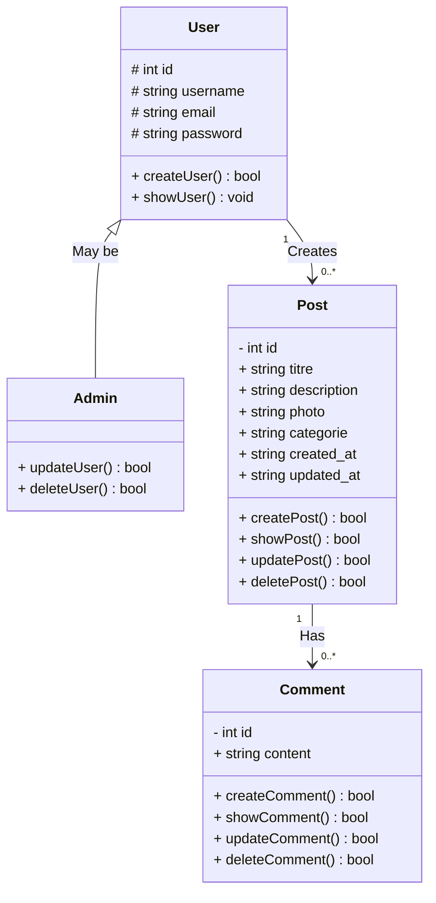

# Class diagram

```mermaid
classDiagram
    class User{
        # int id
        # string username
        # string email
        # string password
        + createUser() bool
        + showUser() void
    }

    class Admin{
        + updateUser() bool
        + deleteUser() bool
    }

    class Post{
      - int id
      + string titre
      + string description
      + string photo
      + string categorie
      + string created_at
      + string updated_at
      + createPost() bool
      + showPost() bool
      + updatePost() bool
      + deletePost() bool
    }

    class Comment{
      - int id
      + string content
      + createComment() bool
      + showComment() bool
      + updateComment() bool
      + deleteComment() bool
    }
            
    User <|-- Admin : May be
    Post "1" --> "0..*" Comment : Has
    User "1" --> "0..*" Post : Creates
```
